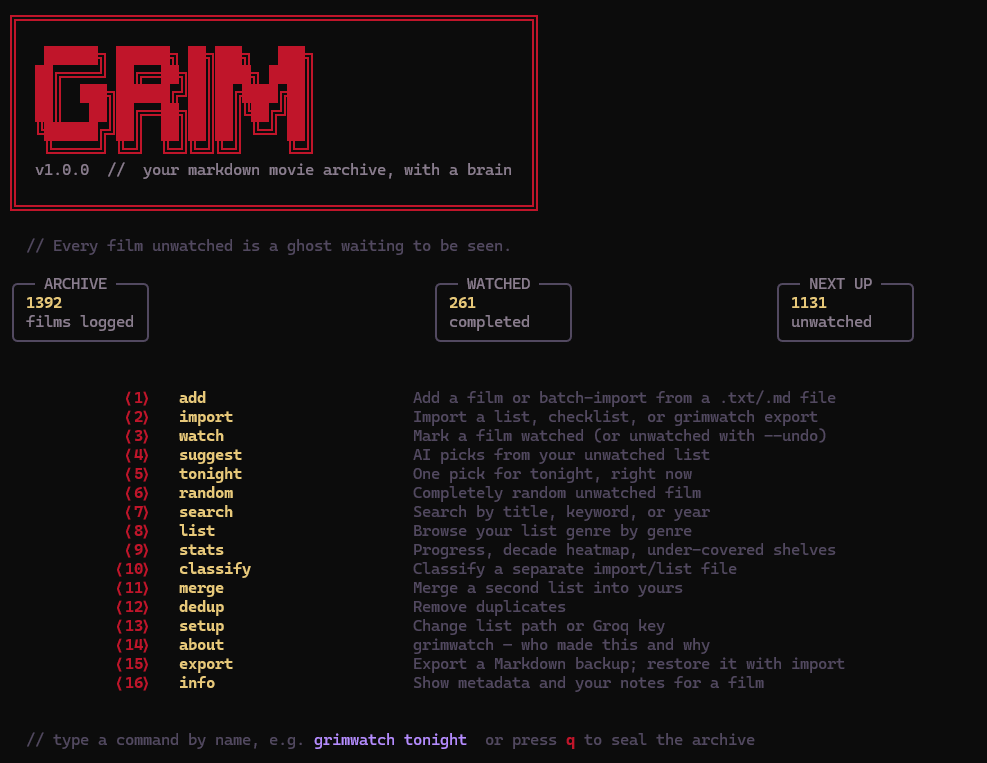
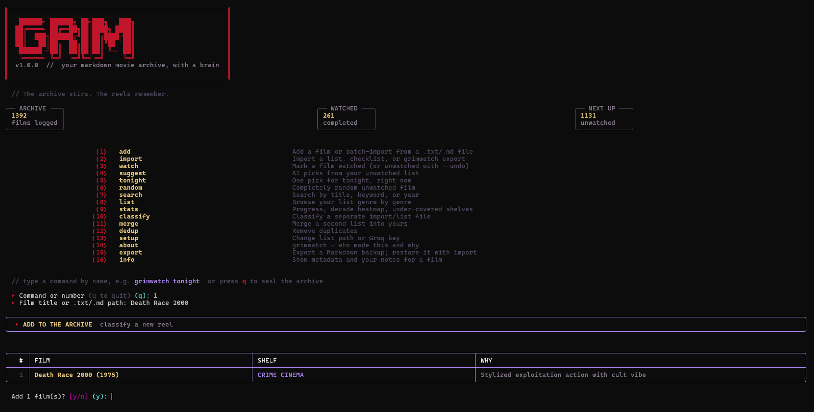
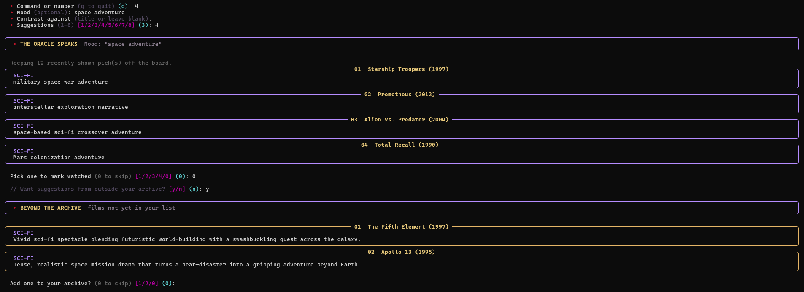
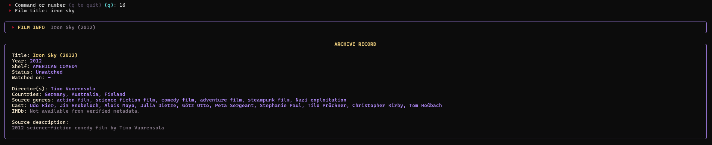
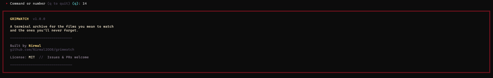

# GRIMWATCH

> *Your markdown movie archive, with a brain.*

A terminal CLI for the films you mean to watch and the ones you'll never forget.
Grimwatch keeps your list in plain markdown — no database, no account, no cloud.
AI handles classification and recommendations. You handle the watching.



---

## Install

```bash
pip install grimwatch
```

Requires Python 3.10+. Works on Windows, macOS, Linux.

---

## Quickstart

```bash
grimwatch                          # open the interactive archive
grimwatch setup                    # connect your list file + Groq key
grimwatch add "Stalker (1979)"     # add a single film
grimwatch add my-list.txt          # batch import from a text file
grimwatch suggest --mood "bleak"   # AI recommendation from your backlog
grimwatch tonight                  # one pick, right now
```

---

## Commands

| Key | Command | What it does |
|-----|---------|--------------|
| 1 | `add` | Add a film or batch-import from a `.txt`/`.md` file |
| 2 | `import` | Import a raw list — no genres or years needed |
| 3 | `watch` | Mark a film watched (or unwatched with `--undo`) |
| 4 | `suggest` | AI picks from your unwatched list |
| 5 | `tonight` | One pick for tonight, right now |
| 6 | `random` | Completely random unwatched film |
| 7 | `search` | Search by title, keyword, or year |
| 8 | `list` | Browse your list genre by genre |
| 9 | `stats` | Progress, decade heatmap, blind spots |
| 10 | `classify` | Classify a separate import/list file |
| 11 | `merge` | Merge a second list into yours |
| 12 | `dedup` | Remove duplicates |
| 13 | `setup` | Change list path or Groq key |
| 14 | `about` | Who made this and why |
| 15 | `export` | Export a Markdown backup; restore it with import |
| 16 | `info` | Show metadata and your notes for a film |

---

## Screenshots

**Adding a film — AI classifies it instantly**



**AI suggestions by mood**



**Film info with metadata**



**About**



---

## How the list works

Grimwatch reads and writes a plain markdown file. Example format:

```markdown
## Horror

- [ ] Suspiria (1977)
- [x] The Wicker Man (1973)

## Crime

- [ ] Memories of Murder (2003)
```

Your list file, your format. Grimwatch stays out of the way.

---

## AI features

AI is powered by [Groq](https://console.groq.com) (free tier available).

- **Classification** — adds genres and years when you import a raw list
- **suggest** — picks from your backlog based on mood or recent watches
- **tonight** — one confident pick, no arguments needed

AI is optional. Every non-AI command works without a Groq key.

---

## Configuration

Config is stored at `~/.grimwatch/config.json`. Run `grimwatch setup` to change anything.

Environment variable override: `GRIMWATCH_CONFIG_DIR`

---

## Contributing

Issues and PRs welcome — see [CONTRIBUTING.md](.github/CONTRIBUTING.md).

---

## License

MIT — see [LICENSE](LICENSE).

Built by [Nirmal](https://github.com/Nirmal2OO8).
